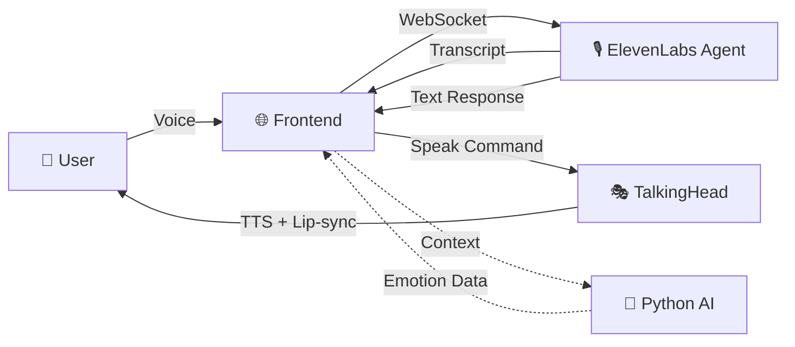

<picture>
  <source media="(prefers-color-scheme: dark)" srcset="https://capsule-render.vercel.app/api?type=waving&color=gradient&customColorList=24&height=200&section=header&text=EUNOIA&fontSize=80&fontColor=ffffff&fontAlignY=35&desc=AI-Powered%20Mental%20Wellness%20Companion&descSize=20&descAlignY=55&animation=twinkling">
  <source media="(prefers-color-scheme: light)" srcset="https://capsule-render.vercel.app/api?type=waving&color=gradient&customColorList=12&height=200&section=header&text=EUNOIA&fontSize=80&fontColor=1a1a2e&fontAlignY=35&desc=AI-Powered%20Mental%20Wellness%20Companion&descSize=20&descAlignY=55&animation=twinkling">
  
</picture>

<div align="center">

**εὔνοια** *(Greek)* — *beautiful thinking, well mind*

A next-generation mental wellness platform featuring real-time AI therapy sessions with a photorealistic 3D avatar, voice interaction, and emotion-aware responses.

<br>

[](https://hackharvard.io/)
[]()
[](https://devpost.com/software/veloria)

<br>

[](https://nextjs.org/)
[](https://www.typescriptlang.org/)
[](https://www.python.org/)
[](https://tailwindcss.com/)
[](https://elevenlabs.io/)
[](https://ai.google.dev/)

[✨ Features](#-features) • [🚀 Quick Start](#-quick-start) • [🏗️ Architecture](#%EF%B8%8F-architecture) • [📖 Documentation](#-documentation)

</div>

---

## 🌟 Overview

<table>
<tr>
<td width="60%">

> 🏆 **Built in 48 hours at [HackHarvard 2025](https://hackharvard.io/)** — Harvard University's premier hackathon
> 
> 📋 [View our Devpost submission](https://devpost.com/software/veloria) *(submitted as "Veloria")*

**EUNOIA** reimagines mental health support through cutting-edge AI technology. Have meaningful conversations with **Sarah**, your AI therapist—a photorealistic 3D avatar that speaks, listens, and responds with empathy.

### What Makes EUNOIA Different?

- 🎭 **Lifelike 3D Avatar** — Real-time lip-sync, facial expressions, and natural animations
- 🎙️ **Voice-First Experience** — Natural conversations powered by ElevenLabs' conversational AI
- 🧠 **CBT-Inspired Responses** — Therapeutic techniques backed by cognitive behavioral therapy
- 🌈 **Audio-Reactive UI** — Beautiful animated gradients that respond to your voice
- 🔒 **Privacy-Focused** — Your conversations stay between you and your AI companion

</td>
<td width="40%">

```
    ┌────────────────────────┐
    │   🧘 EUNOIA Flow       │
    └────────────────────────┘
            │
            ▼
    ┌───────────────┐
    │  🎤 You Speak │
    └───────┬───────┘
            │
            ▼
    ┌───────────────┐
    │ 🤖 AI Thinks  │
    │   (Gemini)    │
    └───────┬───────┘
            │
            ▼
    ┌───────────────┐
    │ 🗣️ Sarah      │
    │   Responds    │
    │  (3D Avatar)  │
    └───────────────┘
```

</td>
</tr>
</table>

---

## ✨ Features

<div align="center">

| Feature | Description |
|:-------:|:------------|
| 🎭 **3D AI Therapist** | Meet Sarah — a photorealistic avatar with real-time lip-sync using [TalkingHead](https://github.com/met4citizen/TalkingHead) |
| 🎙️ **Voice Conversation** | Natural back-and-forth dialogue via ElevenLabs WebSocket streaming |
| 🧠 **Empathetic AI** | CBT-inspired responses powered by Google Gemini with emotion detection |
| 🎨 **Reactive Interface** | Audio-responsive gradient backgrounds that pulse with your voice |
| 📊 **Session History** | Track your wellness journey with saved conversation logs |
| 🔐 **Authentication** | Secure login with NextAuth.js supporting multiple providers |

</div>

### 🎬 Experience Modes

<table>
<tr>
<td width="50%" align="center">

**🖼️ Picture-in-Picture**

The avatar takes center stage with your video in a floating, draggable window

</td>
<td width="50%" align="center">

**📐 Split View**

Side-by-side view for a more balanced conversation experience

</td>
</tr>
</table>

---

## 🚀 Quick Start

### Prerequisites

<table>
<tr>
<td>

```
📋 Requirements
├── Node.js 18+
├── Python 3.9+
├── npm or yarn
└── Modern browser (Chrome/Edge/Safari)
```

</td>
<td>

```
🔑 API Keys Needed
├── Google Gemini API Key
├── ElevenLabs API Key
└── ElevenLabs Agent ID
```

</td>
</tr>
</table>

### 1️⃣ Clone & Install

```bash
# Clone the repository
git clone https://github.com/yourusername/EUNOIA.git
cd EUNOIA

# Install frontend dependencies
cd frontend && npm install

# Install Python dependencies
cd ../Backend/python-service
python3 -m venv venv && source venv/bin/activate
pip install -r requirements.txt

# Install Node.js service dependencies
cd ../node-service && npm install
```

### 2️⃣ Configure Environment

Create `.env` files in each service directory:

<details>
<summary><b>📁 frontend/.env.local</b></summary>

```env
# Authentication
NEXTAUTH_SECRET=your-super-secret-key
NEXTAUTH_URL=http://localhost:3000

# ElevenLabs Configuration
NEXT_PUBLIC_ELEVENLABS_API_KEY=your_elevenlabs_api_key
NEXT_PUBLIC_ELEVENLABS_AGENT_ID=your_agent_id

# Google Configuration (optional, for TalkingHead TTS)
NEXT_PUBLIC_GOOGLE_API_KEY=your_google_tts_api_key
```

</details>

<details>
<summary><b>📁 Backend/python-service/.env</b></summary>

```env
GEMINI_API_KEY=your_gemini_api_key
ALLOWED_ORIGINS=http://localhost:3000
```

</details>

<details>
<summary><b>📁 Backend/node-service/.env</b></summary>

```env
ELEVENLABS_API_KEY=your_elevenlabs_api_key
ALLOWED_ORIGINS=http://localhost:3000
```

</details>

### 3️⃣ Start Everything

The easiest way — use the all-in-one startup script:

```bash
# From project root
./start-all-services.sh
```

Or start services individually:

```bash
# Terminal 1: Frontend (Port 3000)
cd frontend && npm run dev

# Terminal 2: Python AI Service (Port 8000)
cd Backend/python-service && source venv/bin/activate && python main.py

# Terminal 3: Node Voice Service (Port 8001)
cd Backend/node-service && npm start

# Terminal 4: TalkingHead Avatar (Port 8080)
cd Backend/talkinghead && python3 -m http.server 8080
```

### 4️⃣ Open the App

Navigate to **[http://localhost:3000](http://localhost:3000)** and begin your wellness journey! 🧘

---

## 🏗️ Architecture

```
EUNOIA/
├── 🌐 Frontend (Next.js 15)          → Port 3000
│   ├── Real-time voice UI
│   ├── 3D avatar integration (iframe)
│   ├── Animated gradient backgrounds
│   └── Session management
│
├── 🐍 Python AI Service (FastAPI)    → Port 8000
│   ├── Gemini AI conversations
│   ├── Emotion detection
│   ├── CBT-inspired responses
│   └── Biometric processing
│
├── 🟢 Node Voice Service (Express)   → Port 8001
│   ├── ElevenLabs voice synthesis
│   ├── WebSocket connections
│   └── Real-time audio streaming
│
└── 🎭 TalkingHead (Static)           → Port 8080
    ├── 3D avatar rendering (Three.js)
    ├── Real-time lip-sync
    └── Facial animations
```

### System Flow



---

## 📖 Documentation

### Key Technologies

| Layer | Technology | Purpose |
|-------|------------|---------|
| **Frontend** | Next.js 15, React 19, Tailwind CSS | UI framework with server components |
| **Animation** | Framer Motion, Three.js | Smooth transitions & 3D rendering |
| **Voice AI** | ElevenLabs Conversational AI | Real-time voice-to-voice conversation |
| **AI Brain** | Google Gemini | Empathetic, context-aware responses |
| **Avatar** | TalkingHead | Photorealistic 3D character with lip-sync |
| **Auth** | NextAuth.js | Secure authentication |

### 📂 Project Structure

<details>
<summary><b>Frontend Structure</b></summary>

```
frontend/src/
├── app/
│   ├── page.tsx          # Home/dashboard
│   ├── call/             # AI therapy session
│   ├── login/            # Authentication
│   ├── profile/          # User profile
│   ├── history/          # Session history
│   └── api/              # API routes
├── components/
│   ├── ui/               # Reusable UI components
│   └── prompt-kit/       # Chat input components
├── hooks/
│   ├── useElevenLabsAgent.ts  # Voice AI hook
│   └── useWebAudioQueue.ts    # Audio playback
└── lib/
    └── config.ts         # App configuration
```

</details>

<details>
<summary><b>API Endpoints</b></summary>

#### Python Service (`:8000`)

| Endpoint | Method | Description |
|----------|--------|-------------|
| `/chat` | POST | AI conversation with CBT therapy |
| `/analyze-emotion` | POST | Detect emotion from text/voice |
| `/process-biometrics` | POST | Adaptive recommendations |
| `/health` | GET | Service health check |

#### Node Service (`:8001`)

| Endpoint | Method | Description |
|----------|--------|-------------|
| `/voice/synthesize` | POST | Text-to-speech conversion |
| `/chat-with-voice` | POST | AI response + voice synthesis |
| `/health` | GET | Service health check |

</details>

---

## 🎨 UI Highlights

### Audio-Reactive Gradients

The background dynamically responds to audio levels:

- **Silent/Idle** — Calming purple & violet tones
- **Speaking** — Vibrant mix of colors
- **Loud** — Warm red & orange hues

### Controls

| Key | Action |
|-----|--------|
| `Space` | Start/stop session |
| `M` | Mute/unmute microphone |
| `V` | Toggle video |
| `C` | Toggle captions |

---

## 🔧 Configuration

### ElevenLabs Agent Setup

1. Create an account at [ElevenLabs](https://elevenlabs.io/)
2. Navigate to **Conversational AI** → **Create Agent**
3. Configure your agent's personality and voice
4. Copy the **Agent ID** to your `.env.local`

### Gemini AI Setup

1. Get an API key from [Google AI Studio](https://ai.google.dev/)
2. Add to `Backend/python-service/.env`

---

## 🚧 Roadmap

- [ ] 🩺 **Licensed Therapist Connect** — Real human support integration
- [ ] 🐱 **Wellness Companion** — Meet Meow, your emotional support buddy
- [ ] 📈 **Mood Analytics** — Track emotional patterns over time
- [ ] 🎵 **Adaptive Music Therapy** — Background music that responds to your mood
- [ ] ⌚ **Wearable Integration** — Heart rate & HRV monitoring
- [ ] 🌍 **Multi-language Support** — Global accessibility

---

## 🤝 Contributing

Contributions are welcome! Please read our contributing guidelines before submitting a PR.

```bash
# Fork the repo
# Create your feature branch
git checkout -b feature/amazing-feature

# Commit your changes
git commit -m 'Add some amazing feature'

# Push to the branch
git push origin feature/amazing-feature

# Open a Pull Request
```

---

## 📄 License

This project is licensed under the MIT License — see the [LICENSE](LICENSE) file for details.

---

## 👥 Team

Built with 💜 by:

| | Name | Role |
|:-:|:-----|:-----|
| 👨‍💻 | **Aditya Punjani** | Full Stack Developer |
| 👨‍💻 | **David Nintang** | Full Stack Developer |
| 👨‍💻 | **Sidharth Jain** | Full Stack Developer |
| 👨‍💻 | **Aiden Miah** | Full Stack Developer |

---

## 🙏 Acknowledgments

- [HackHarvard 2025](https://hackharvard.io/) — For hosting an amazing hackathon
- [TalkingHead](https://github.com/met4citizen/TalkingHead) by met4citizen — 3D avatar technology
- [ElevenLabs](https://elevenlabs.io/) — Voice AI technology
- [Google Gemini](https://ai.google.dev/) — AI conversation engine
- [Ready Player Me](https://readyplayer.me/) — 3D avatar creation

---

<div align="center">

<picture>
  <source media="(prefers-color-scheme: dark)" srcset="https://capsule-render.vercel.app/api?type=waving&color=gradient&customColorList=24&height=100&section=footer">
  <source media="(prefers-color-scheme: light)" srcset="https://capsule-render.vercel.app/api?type=waving&color=gradient&customColorList=12&height=100&section=footer">
  
</picture>

**Made with 💜 for mental wellness**

*Your mind matters. Take care of it.*

</div>
